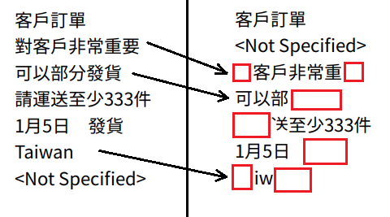

Non rendered characters in PDFKit
===

This repo demonstrates issue with non rendered characters in text when mixing different languages (in this case Chinese and English with `'<'` and `'>'` symbols).

Depending on the order text is rendered, resulting PDF may have different characters missing.

For more details compare `output-correct.pdf` and `output-incorrect.pdf` files.

Next image shows `output-correct.pdf` (on left side) compared to `output-incorrect.pdf` (on right side) with missing characters (highlighted with red rectangle). Arrows points to corresponding lines.

